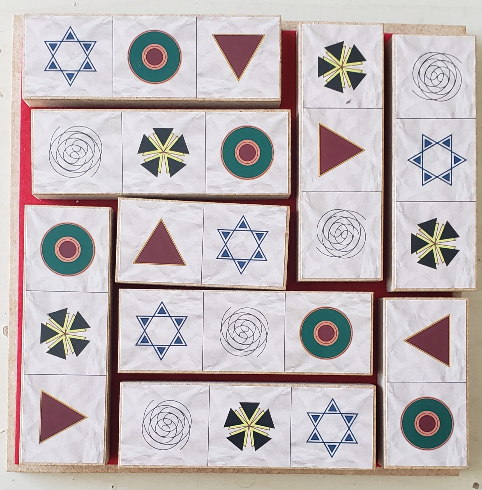
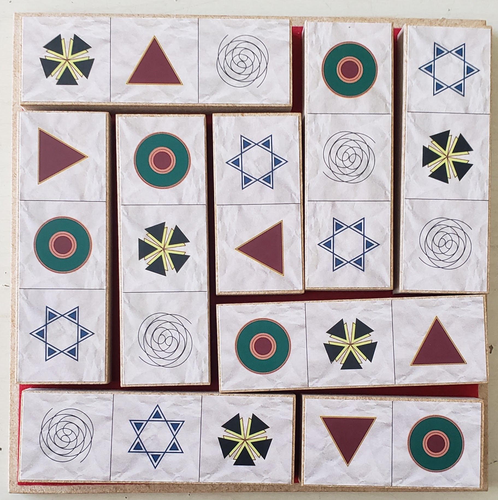
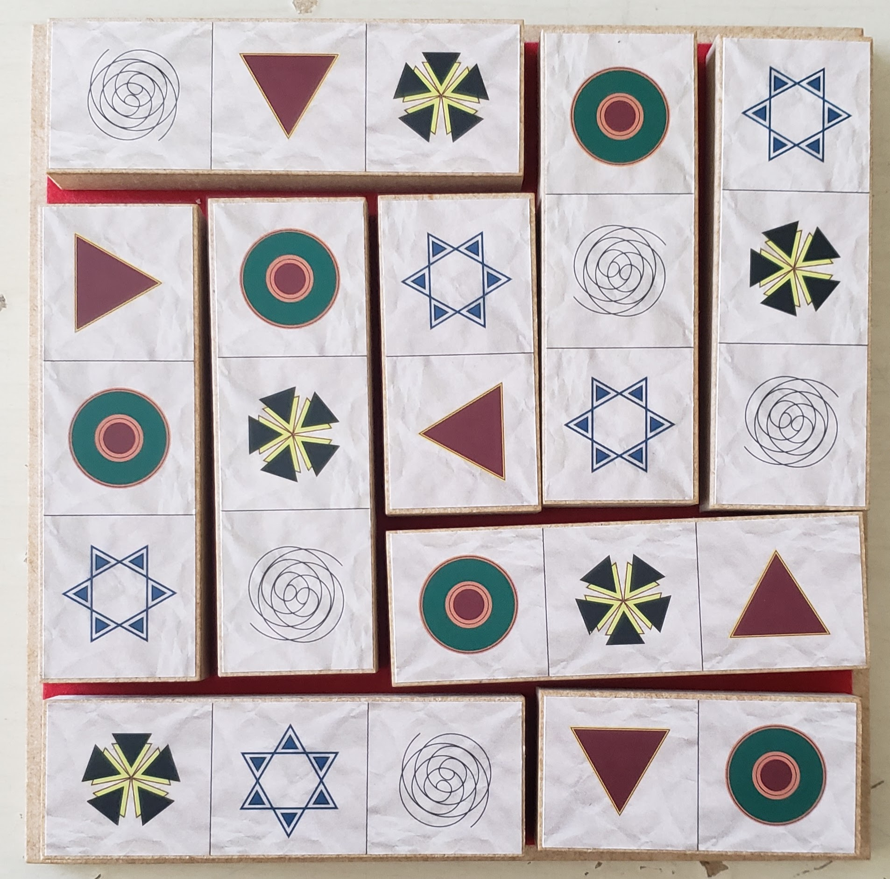

# Description

This script solves Ili Kaufman's [5 Squared puzzle](http://thinkingames.com/WorkPages/ProductSingle.aspx?pID=5) from ThinkinGames.

It is about 350 lines and takes about 15 seconds to run on an i5, unoptimized.

# Algorithm Selection

##### Always check the simple brute force first.

There are `5^25` permutations of the grid if you ignore rotation and piece constraints. That's 298 quadrillion possibilities, which is way too much to brute force. Even if each grid took 1 microsecond to check, the whole state space would take 1000 years to verify.

##### What about if we approach it with the piece-placing route?

Each 1x2 piece has 20 positions while vertical and 20 positions while horizontal. Then if you count for flipping while in each position, that's 80 positions total. Each 1x3 piece has 15 positions while vertical and 15 positions while horizontal. Then if you count for flipping while in each position, that's 60 positions total. 

There are two 1x2 pieces and seven 1x3 pieces, so we have `80^2*60^7` = 1.79e16. This is 18 quadrillion instead of 298. We're getting a little closer.

In reality, there are many fewer because as each piece is placed, it increasingly constrains the available positions of the remaining pieces.

##### Sounds like we should do a recursive piece-placing strategy, failing fast if any configuration fails?

Ok but first, ignore the symbols. Let's simply check the permutations for shape placement. Once we have this number N, we can probably brute force. For each shape-constrained grid, we'll have `14*12*10*8*6*4*2*4*2` options, or 5,160,000. The number N shouldn't be too high, there are only so many ways to organize items of length 3 in a 5x5 grid.

Well let's look at an anchoring strategy for the recursion. This will constrain it even further. No matter the state of the grid, every piece can be considered to have an anchor: its upper-left-most cell. So every grid has 9 anchors. From each anchor, there are only 4 options: 3x1 horizontally, 3x1 vertically, 2x1 horizontally, 2x1 vertically. So we can iterate through each of these permutations, `4^9` = 262,000. Starting in the upper left origin, walk all of these paths with 4 branches at each anchor. This should yield 4x duplicate solutions as well for 90deg rotations, so we expect ~65,000 total iterations to find N from above, N, being a much smaller number because a small percentage of the anchor permutations fit all 9 pieces on the grid.

There ended up being 164 permutations of shape placements, counting all rotations, which means that N = 41. The calculation of this, the first portion, only takes ~100ms on my i5.

The first attempt at part 2, recursively placing all permutations of the 9 pieces for 5,160,000 options without fail-fast, railed my laptop at 100% cpu for 4 minutes, growing the stack to about 85% of my 4GB of RAM then using the majority of 8GB swap as well. The calculation was not done after 20min, for a single grid of the N=41, so I killed it and proceeded with the validity check after each placement.

Properly failing fast on part two's recursion yields 32 solutions in ~16s on my i5. This is from N = 164, so we haven't respected rotation yet. The stack is negligible in mem. Once all 32 solutions are known, we could write a programmatic deduplication of the rotation/mirror equivalents, but 32 is small enough to do by hand.

# Solutions

